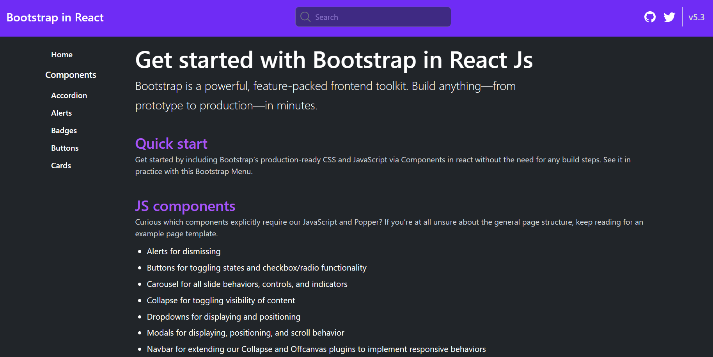
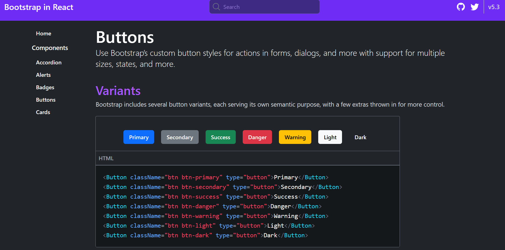

# Bootstrap component in react App

React Bootstrap Components Generator is a tool that allows users to create Bootstrap components using HTML, JS, JS DOM, TailwindCSS, and ReactJS. It is built using Vite for a fast development experience.


## Table of Contents
- [Screenshots](#screenshots)
- [Installation](#installation)
- [Usage](#usage)
- [Features](#features)

## Screenshots
- **ScreenShot 1**
  
- **ScreenShot 2**  
    


## Installation

1. Clone the repository:

```bash
git clone https://github.com/san1234100/boostrap-component-react.git
```
2. Navigate into the project directory:
```bash
cd boostrap-component-react
```

3. Install dependencies using npm or yarn:
```bash
npm install
```

4. Start the development server:
```bash
npm run dev
```


## Usage
 
- Open your web browser and go to http://localhost:3000.

-Use the tool to create Bootstrap components using HTML, JS, JS DOM, TailwindCSS, and ReactJS.


## Features
- Create Bootstrap components using HTML, JS, JS DOM, TailwindCSS, and ReactJS.
- Real-time preview of generated components.
- Easy-to-use interface.


# Happy coding!😁🧑‍💻